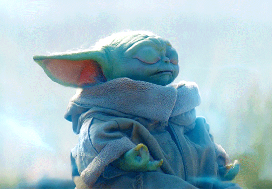

# What is grogu

> Quoted from Wikipedia: 
> 
> [Grogu](https://en.wikipedia.org/wiki/Grogu) is a character from the Star Wars Disney+ original television series The Mandalorian. He is an infant member of the same unnamed alien species as the Star Wars characters Yoda and Yaddle, with whom he shares a strong ability in the Force. In the series, the protagonist known as "The Mandalorian" is hired to track down and capture Grogu for a remnant of the fallen Galactic Empire, but instead, he becomes his adoptive father and protects him from the Imperials. The character's real name was not revealed until "Chapter 13: The Jedi", in which it is explained that Grogu was raised at the Jedi Temple on Coruscant during the Clone Wars. Prior to this, the character's official name, as used in subtitles and captions, was "The Child".
> 
> Grogu has appeared in every episode of the series with the exception of "Chapter 15: The Believer". He was created by The Mandalorian creator and showrunner Jon Favreau based upon his desire to explore the mystery around Yoda and his species. The character was further developed in early conversations between Favreau and executive producer Dave Filoni, and the character's imagery was defined by concept artist Christian Alzmann. Grogu is mostly a work of animatronics and puppetry, although accentuated with computer-generated imagery.

<table xmlns="http://www.w3.org/1999/html">
	<tr >
	    <td></td> 
        <td></td>
	</tr>
</table>

> The puppet was designed by Legacy Effects and cost about $5 million to make.[1] It is controlled by two technicians, one who operates the eyes and mouth and another who controls other facial expressions. The character's voice and sounds were created using a combination of adult and infant vocals, as well as recordings of a bat-eared fox and kinkajou. The dynamic between the Mandalorian and Grogu embodies a theme of parenting and fatherhood prevalent in The Mandalorian, with the character also raising questions about good and evil and nature versus nurture in the series.
> 
> Grogu has received a positive reception from fans and reviewers, is widely considered the show's breakout character,[2][3] and quickly became a popular Internet meme. The Guardian called him "2019's biggest new character",[4] and The Hollywood Reporter has said the character "represents the future of Hollywood".[5] Many writers have described Grogu as a key part in the success of Disney+. Grogu was kept secret and was deliberately withheld from The Mandalorian's pre-release marketing and merchandise plans to avoid leaks before the show aired. As a result, merchandise of Grogu was not immediately available after the first season debuted in November 2019, which some analysts say cost Disney $2.7 million in revenue, but Bob Iger, Disney's CEO at the time of The Mandalorian's premiere, has defended the strategy.

<table xmlns="http://www.w3.org/1999/html">
	<tr >
	    <td></td> 
        <td></td>
	</tr>
</table>
